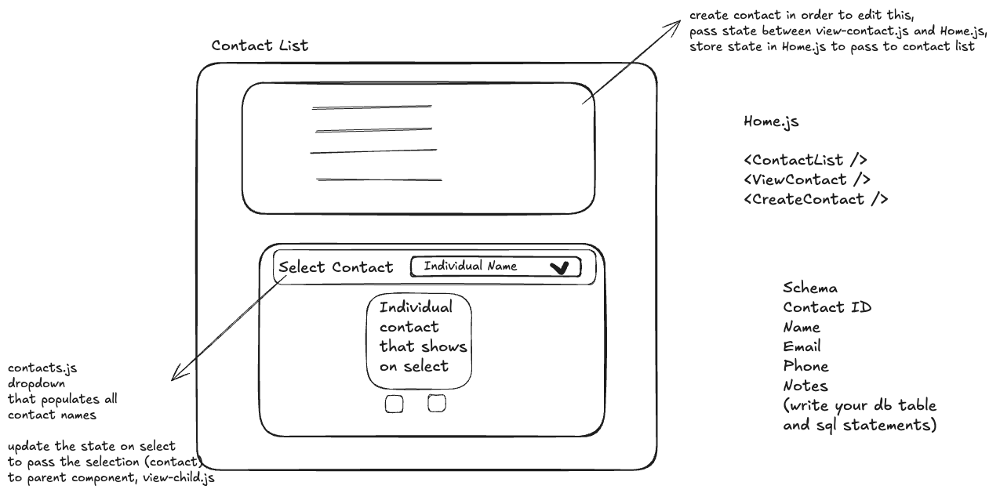

# Mai Contact 
- An event form to manage your contacts.

# Planning for the Contact Form:

# Frameworks: 
- Backend: ExpressJS, Node.js, SQL Postgres
- Frontend: React JavaScript 

# Libraries/Technologies: 

# Installation: 
To install and run this locally, follow these steps:

# Clone the Repository: 
First, clone the repository to your local machine using the following command: 
`git clone [link to repo](https://github.com/Maithanhceu/techtonica_assignments-/tree/85e8d63c4a75adff46bfbbb9fc40e8eab8ae4753/mai_ContactList)`

# Install Dependencies and Run the Server:
Navigate to the project directory and install the required dependencies, then start the development server using the following commands:

`npm install`
`npm run dev`

# Open the  in the browser and you should see the following Contact: 

# You can add and delete an Contact:

