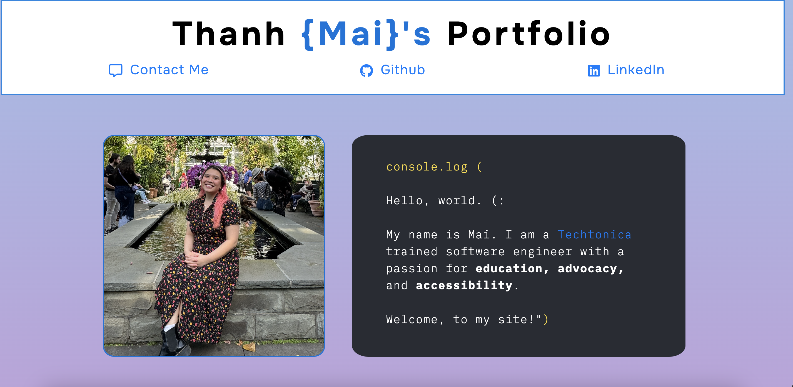

# Mai Portfolio

- A Portfolio Featuring My Contacts, About Me Section, and Additional Information

# Primary Goals
- To demonstrate understanding of the foundational topics covered in the first two weeks of Techtonica before diving further into the PERN stack.
- Create a new HTML/CSS webpage
- Modify the contents of your page using DOM methods
- Use common CSS rules to align content (left, right, center), modify colors, sizes of containers and text, etc.
Get comfortable using CSS media queries

# Frameworks: 
- HTML, JavaScript, CSS

# Libraries/Technologies: 

# Clone the Repository: 
First, clone the repository to your local machine using the following command: 

`git clone hhttps://github.com/Maithanhceu/techtonica_assignments-/tree/b0fa8bfb257c1e174c524844b81a6308b8c0a8c2/mai_Portfolio`

# How to Run
1. Open the `index.html` file in your web browser:
   - You can do this by double-clicking the file or right-clicking and selecting "Open with" to choose your preferred browser.

2. Interact with the page:
   - Watch the animated greeting text appear.
   - Use the contact form to send a message (note that the form does not have back-end functionality yet).

# Open the application in the browser and you should see the following  page: 

# Stretch Goals: 
Refactor my CSS using Flexbox! A lot of this code is already refactor from the original which had less JavaScript. 

**Feel free to explore my projects and contact me! You can contact me at [Mai's LinkedIn Profile](https://www.linkedin.com/in/mai-th2024/)**
