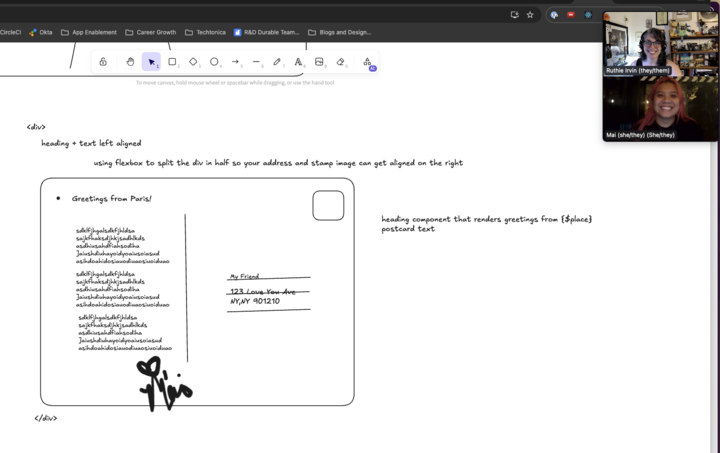

# Planning stage for Mai BLog App

# Mai Blog 
- A blog that documents all the places that I (Mai) have travelled to for users to see and review. You can also create a blog entry, though for personal purposes I have opted out of allowing users to delete any entries as these are personal memories, and like, memories they should not be deleted. They can be added to, similar to adding a memory. 

# Frameworks: 
- Backend: ExpressJS, Node.js, SQL Postgres
- Frontend: React JavaScript 

# Libraries/Technologies: 

# Installation: 
To install and run this locally, follow these steps:

# Clone the Repository: 
First, clone the repository to your local machine using the following command: 
`git clone `

# Install Dependencies and Run the Server:
Navigate to the project directory and install the required dependencies, then start the development server using the following commands:

`npm install`
`npm run dev`

# Open the  in the browser and you should see the following blog page: 

# You can add a blog entry: 

# Flex Goals: 
A playlist that allows users to have a more personal experience as they listen to all the music from my travels. 